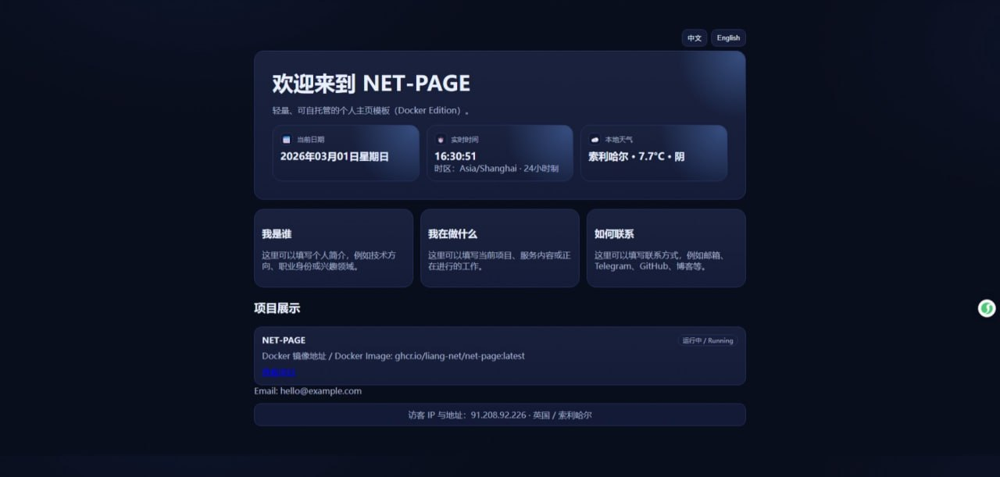
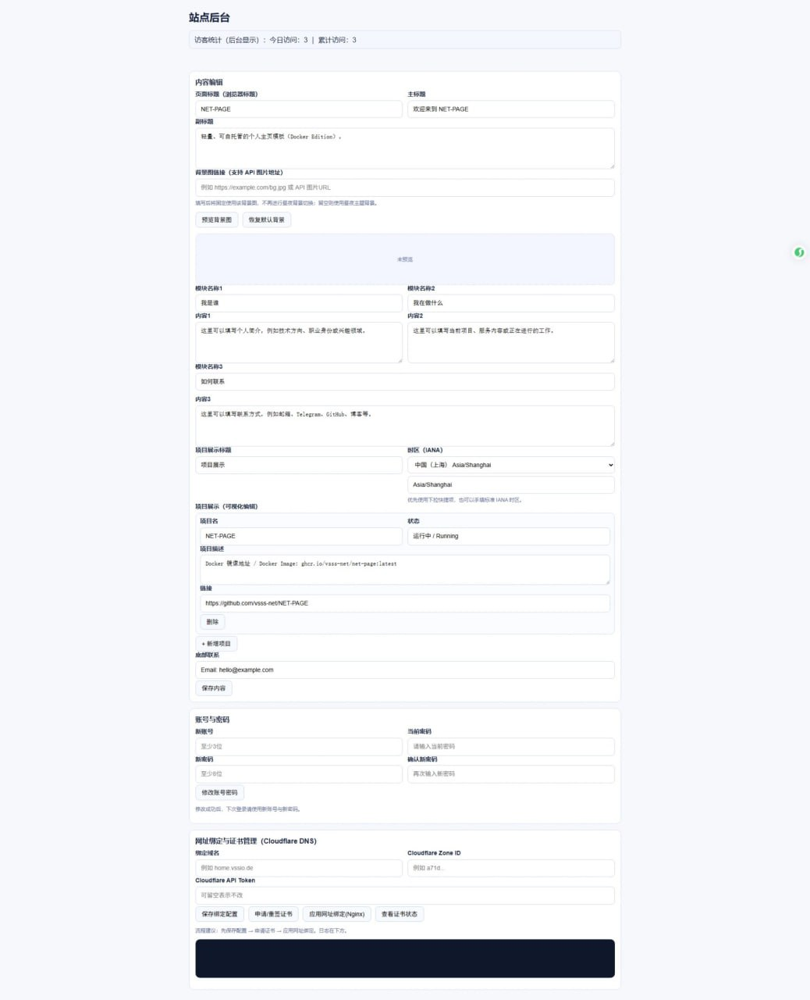

# NET-PAGE


轻量网络主页（静态页 + 管理后台），Docker 发布版。  
Lightweight personal homepage (static site + admin backend), Docker edition.

## 初始后台账号密码 / Default Admin Credentials

- Username / 账号：`admin`
- Password / 密码：`change-me-please`
- Login URL / 登录地址：`http://SERVER_IP:3838/admin`

> 首次登录后请立即在后台「账号与密码」模块修改默认凭据。  
> Please change default credentials immediately after first login.

## Project Preview / 项目预览

### Home / 前台



### Admin / 后台



## Docker Image / 镜像地址

- `ghcr.io/liang-net/net-page:latest`

## Docker Orchestration / Docker 编排方式

- 当前项目采用 **Docker Compose 编排**（单机编排）
- Compose file: `docker-compose.yml`
- 启动方式：
  - v2: `docker compose up -d --build`
  - v1: `docker-compose up -d --build`

## Default Port / 默认端口

- `3838` (host) -> `80` (container)

---

## 中文安装说明（详细）

### 1) 环境准备
- Linux 服务器（建议 Ubuntu 22.04/24.04）
- 已安装 Docker
- 已安装 Docker Compose（支持 v2 `docker compose` 或 v1 `docker-compose`）

安装（Ubuntu，兼容 v1 + v2）：
```bash
sudo apt update
sudo apt install -y docker.io docker-compose docker-compose-plugin
sudo systemctl enable --now docker
```

验证命令：
```bash
docker --version
docker compose version || true
docker-compose --version || true
```

### 2) 获取项目
```bash
git clone https://github.com/liang-net/NET-PAGE.git
cd NET-PAGE
```

### 3) 修改后台账号密码（强烈建议）
编辑 `docker-compose.yml`：
- `ADMIN_USER`
- `ADMIN_PASS`

### 4) 启动
优先使用 v2：
```bash
docker compose pull
docker compose up -d --build
```
如系统仅有 v1：
```bash
docker-compose pull
docker-compose up -d --build
```

### 5) 访问
- 主页：`http://服务器IP:3838`
- 管理页：`http://服务器IP:3838/admin`

### 6) 更新
v2：
```bash
git pull
docker compose up -d --build
```
v1：
```bash
git pull
docker-compose up -d --build
```

### 7) 停止与卸载
v2：
```bash
docker compose down
```
v1：
```bash
docker-compose down
```

---

## English Installation Guide (Detailed)

### 1) Prerequisites
- Linux server (Ubuntu 22.04/24.04 recommended)
- Docker installed
- Docker Compose installed (supports v2 `docker compose` or v1 `docker-compose`)

Install on Ubuntu (v1 + v2 compatible):
```bash
sudo apt update
sudo apt install -y docker.io docker-compose docker-compose-plugin
sudo systemctl enable --now docker
```

Verify:
```bash
docker --version
docker compose version || true
docker-compose --version || true
```

### 2) Clone repository
```bash
git clone https://github.com/liang-net/NET-PAGE.git
cd NET-PAGE
```

### 3) Change admin credentials (strongly recommended)
Edit `docker-compose.yml`:
- `ADMIN_USER`
- `ADMIN_PASS`

### 4) Start services
Prefer v2:
```bash
docker compose pull
docker compose up -d --build
```
If only v1 is available:
```bash
docker-compose pull
docker-compose up -d --build
```

### 5) Access
- Site: `http://SERVER_IP:3838`
- Admin: `http://SERVER_IP:3838/admin`

### 6) Upgrade
v2:
```bash
git pull
docker compose up -d --build
```
v1:
```bash
git pull
docker-compose up -d --build
```

### 7) Stop
v2:
```bash
docker compose down
```
v1:
```bash
docker-compose down
```
